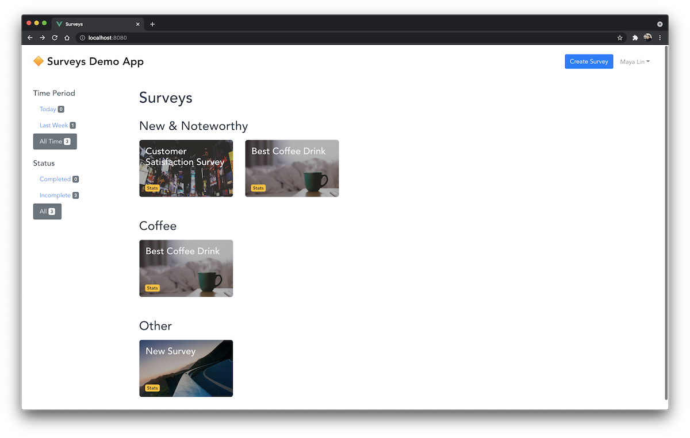
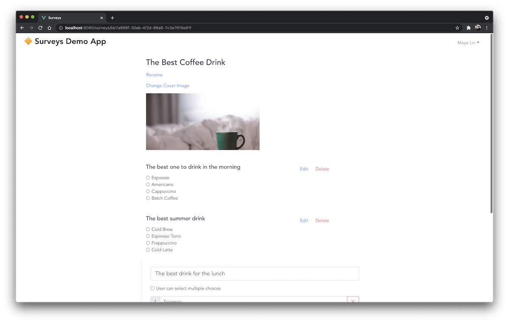
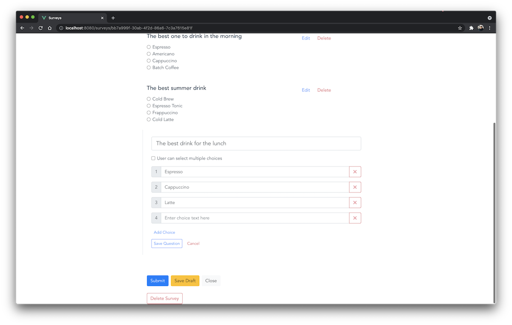
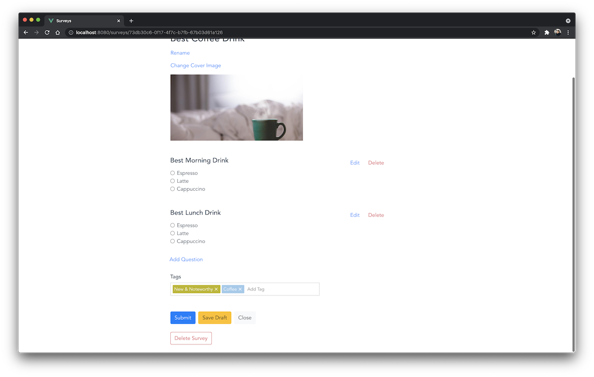
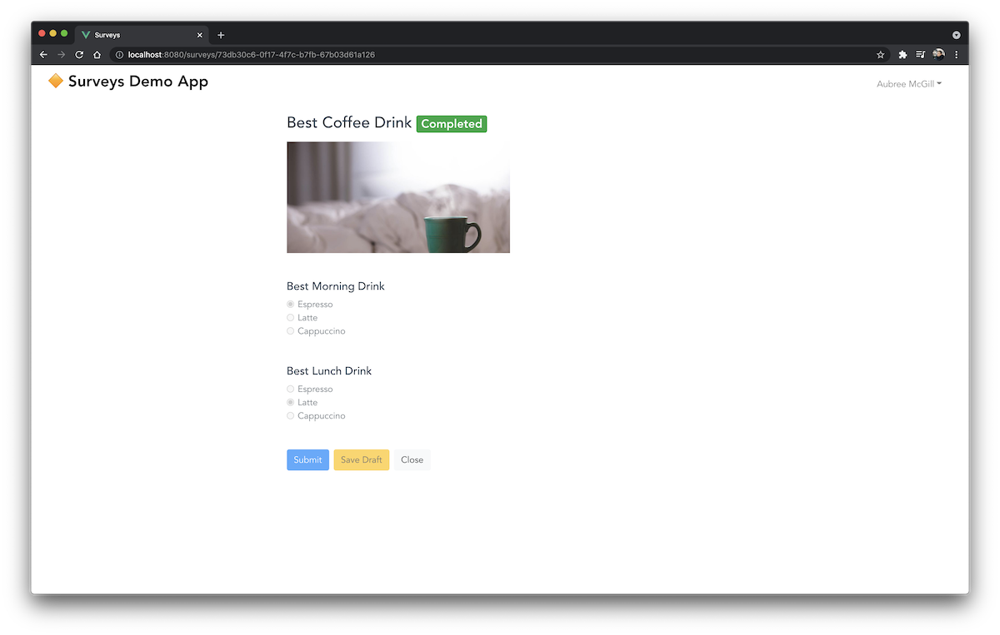
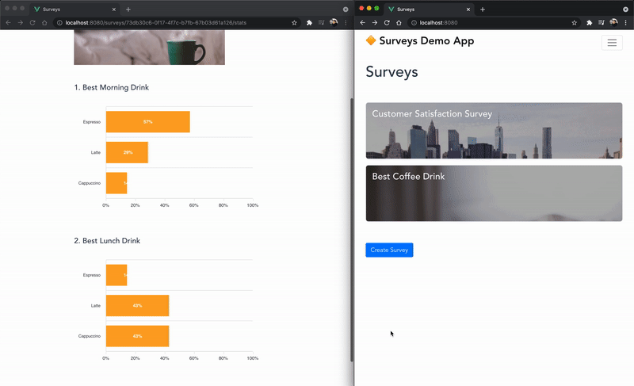
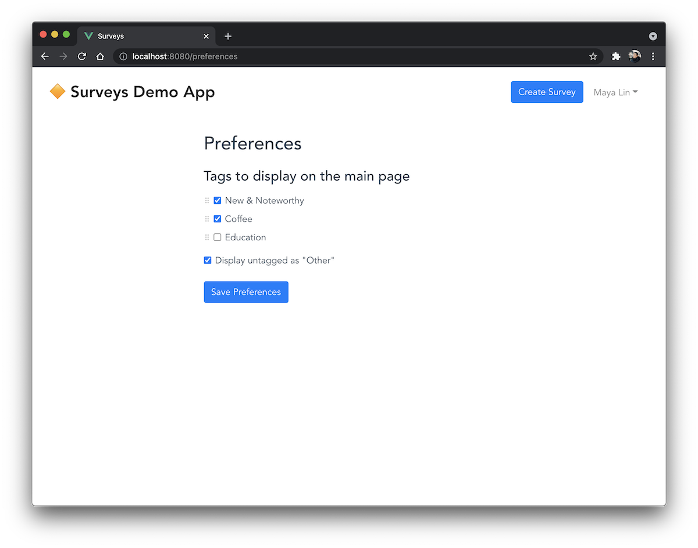

# Surveys (Kotlin+Spring+Vue.js Fullstack Boilerplate / Demo) 

## Summary

The Surveys is a demo application based on **Kotlin + Vue.js** development stack. It's packed with various frequently used features (see the details below) implemented in the basic shape. Mainly I've developed it to have a boilerplate repository for future pet projects 🏗. 

This repository will evolve as I have time to add new features and optimize existing functionality.

The idea of application is to provide a platform for conducting surveys and having simple real-time analytics for running polls. There're 2 kinds of actors: coordinators creating surveys, and respondents.

- Surveys list with filters by date or status



- Composing a survey





- Tagging a survey



- Different views for Respondents and Coordinators



- Reviewing real-time survey responses statistics



- Updating user preferences



## Design

It showcases the following list of concepts:

- #### Kotlin and Spring backend API development

I've started using Kotlin on new backend projects 2 years ago, and it's my first repository to have boilerplate code for full-stack apps with Kotlin. Here I'm using Kotlin in pretty much the same Spring setup as I would use Java.      

- #### Rapid CRUD bootstrapping using Spring Data REST

It's arguable whether Spring Data REST is a good fit for a production-ready project. On the other hand, it allows a rapid start having full-blown API implementation with sorting, paging and filtering for given entities.

Any given controller can be extended with additional handlers or reimplemented from scratch as a separate custom REST endpoint.  

- #### Database migrations with Liquibase

Hibernate JPA auto schema creation was used during the development. After the first version of the schema had been finalized, I generated the Liquibase changelog from JPA entities and disabled `ddl-auto` by Hibernate.

To populate schema with some initial data (predefined users), there's sql script on classpath.

- #### Security

JWT-based authentication with role-based access is showcased with tokens issued by the backend. Such a setup must not be used in production, this functionality is only to demonstrate the flow. In a real solution, use IAM solution like Keycloak or 3rd party SaaS.

- #### Reactive flow for live data streaming

After reading the [official guide on Spring Webflux + RSocket](https://spring.io/guides/tutorials/spring-webflux-kotlin-rsocket/) I got an idea to implement some real-time streaming functionality to try Reactive Streams in a demo application setup. 

The survey statistics page is implemented using rsocket.js, it reads the survey response stream data from a Kotlin Flow that is populated with data from R2dbc H2 reactive-ready driver. The charts are updated on a survey stats page in real time. 

- #### Building with Gradle

As a sidenote, I've never used Gradle before, always preferring Maven as a tool that makes more sense to me. This was an interesting challenge to create something new with Gradle, especially writing the build script with Kotlin DSL since there're not many ready-to-use examples.

> Some features are still in development 👷‍♂️. Don't consider the current implementation to be polished at this stage. The nearest TODOs:
> - User management CRUD table
> - User registration 
> - User profile editing
> - Filtering survey list
> - Sample integration tests for the rsocket interactions

### The Backend Stack

- Kotlin 1.4
- Spring Boot 2.4.3
- Spring Data REST
- Spring Security (JWT-based authentication)
- Spring WebFlux
- Hibernate JPA
- H2 Database
- Liquibase (database migrations)
- Gradle Build 
- JUnit 5

### The Frontend Stack

- Vue.js 2
- Vuex  
- Vue-router
- Vue-image-upload
- Bootstrap 4
- RSocket
- Apexcharts

## Launch

### Backend

Running in a command line
```shell
./gradlew bootRun
```

Running in a Docker container
```shell
# build an image of 'surveys-backend'
./gradlew docker

# run a container
docker run -p 8081:8081 -p 8082:8082 surveys-backend:1.0.0-SNAPSHOT
```

### Frontend 

Running in a command line with `yarn` 
```shell
cd client
yarn serve
```

It launches the web application at http://localhost:8080

There're 2 predefined users:
```
m.lin@surveys.com / !F85BVekCVM3uDKyty (role: Coordinator)
a.mcgill@surveys.com / 12345!abc (role: Respondent)
```

## License

MIT
